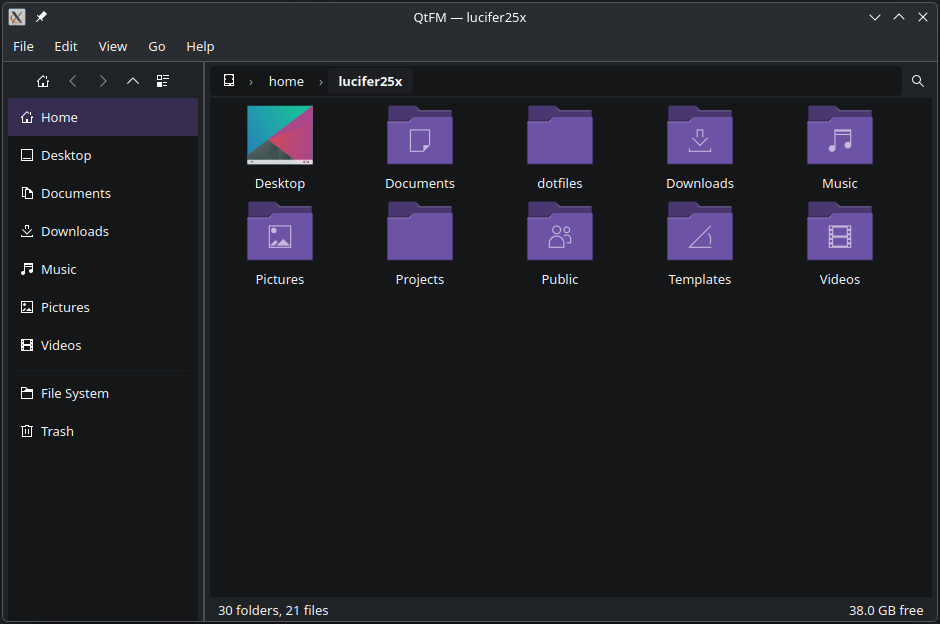

# QtFM

A lightweight file manager for Linux, built with Python and PySide6 as a university project
to demonstrate data structures and algorithms in a practical context.



---

## Features

### Navigation
- Browse the filesystem with a tree view or icon grid view
- Breadcrumb bar
- Back, forward, and parent folder navigation
- Direct path editing by double-clicking the breadcrumb bar
- Sidebar with quick access to common folders and trash

### File Operations
- Create files and folders
- Rename, cut, copy, and paste (with conflict resolution)
- Move to trash and restore using the FreeDesktop Trash spec
- Permanently delete files and folders
- Multiple selection
- Open folders in a new window
- Open terminal in directory

### Search
- Search in current folder or across the entire filesystem
- Choose between BFS (breadth-first) and DFS (depth-first) traversal
- Double-click a result to navigate to its containing folder

### Compression
- Compress text files using Huffman encoding implementation
- Decompress `.huff` files back to their original content

### View & Sort
- Toggle between grid and tree views
- Sort by name, size, or date in ascending or descending order
- Show or hide hidden files and directories
- Zoom in, out, and reset icon size in grid view

### Properties
- File and folder properties dialog with general info and permissions
- Directory size computation

---

## Data Structures & Algorithms

This project was built as a university assignment and intentionally demonstrates several data structures and algorithms:

| Concept | Where used |
|---|---|
| **Singly linked list** | Breadcrumb path representation |
| **Binary tree** | Huffman encoding/decoding tree |
| **Stack** | DFS file search, back/forward navigation history |
| **Queue** | BFS file search |
| **Min-heap** | Huffman tree construction via `heapq` |
| **Frequency table** | Character frequency counting for Huffman |
| **Thread + queue** | Background search worker with result streaming |

---

## Dependencies

```
PySide6
send2trash
bitarray
```

---

## Running

```bash
git clone https://github.com/Lucifer25x/qtfm.git
cd qtfm
```

If using pip:

```bash
pip install PySide6 send2trash bitarray
python main.py
```

Or using `uv`:

```bash
uv sync
uv run main.py
```

---

## Project Structure

```
qtfm/
├── main.py
└── app/
    ├── file_manager.py       # Main window
    ├── core/
    │   ├── model.py          # QFileSystemModel with icon provider
    │   ├── path_logic.py     # PathLinkedList for breadcrumbs
    │   └── trash.py          # FreeDesktop Trash spec implementation
    ├── ui/
    │   ├── actions.py        # Central QAction registry
    │   ├── context_menu.py   # Context menu builder
    │   ├── dialogs.py        # Properties dialog
    │   ├── menubar.py        # Application menubar
    │   ├── sidebar.py        # Sidebar widget
    │   ├── toolbar.py        # Toolbar with breadcrumbs and search bar
    │   └── views.py          # File views (tree, grid, search results)
    ├── algorithms/
    │   ├── huffman.py        # Huffman encode/decode implementation
    │   ├── search.py         # BFS and DFS search generators
    │   └── search_worker.py  # Background search thread with queue
    └── utils/
        ├── file_ops.py       # File operations (create, rename, copy, cut, paste)
        └── icon_provider.py  # Custom file icon provider with fallbacks
```

---

## Platform

Targets Linux. Not designed to be cross-platform, though minor changes to path logic and trash handling would make it work on Windows.

Tested on:
- **OS:** CachyOS Linux (Arch-based)
- **Kernel:** 6.9.0-1 (CachyOS)
- **Desktop:** KDE Plasma
- **Python:** 3.14.5
- **PySide6:** 6.9.1
- **Qt:** 6.9.1